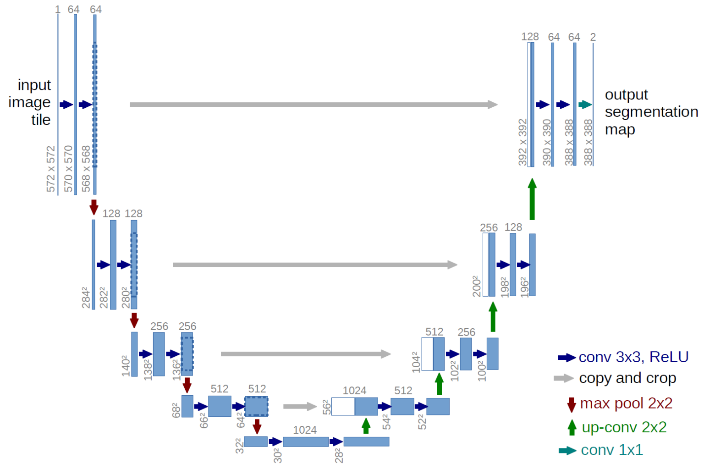
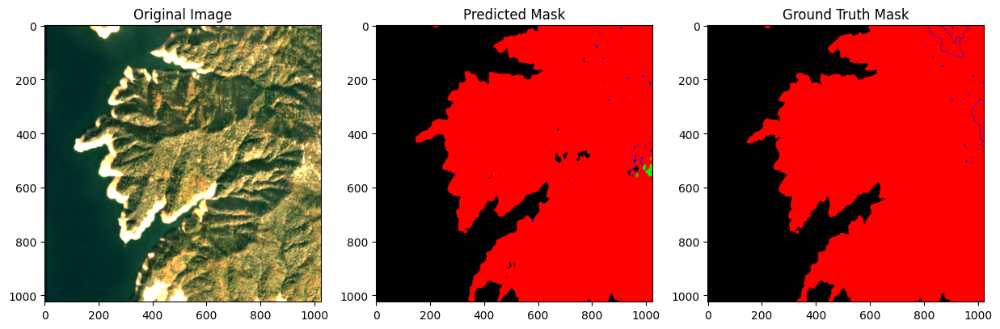
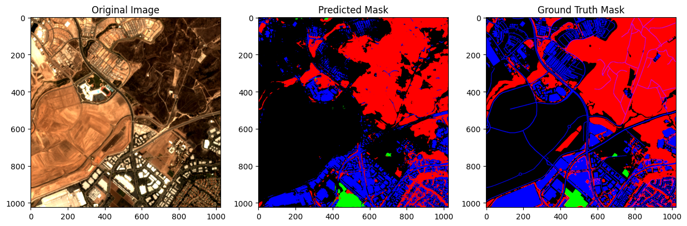
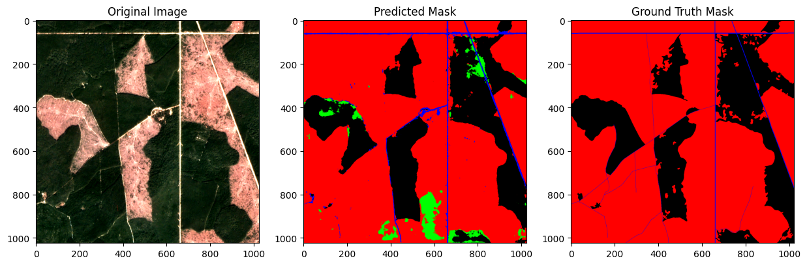
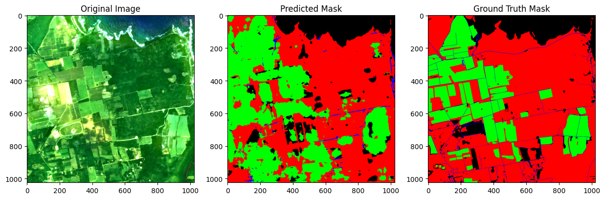
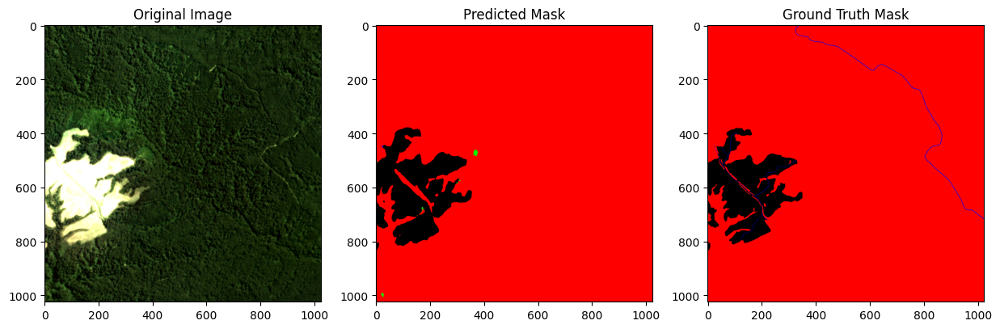
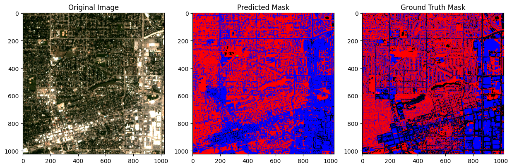

# unet-satellite-segmentation
Lo scopo di questo progetto è quello di risolvere il problema della segmentazione
semantica applicata alle immagini satellitari multispettrali del dataset DynamicEarthNet. In particolare, verrà sviluppata da zero una rete neurale convoluzionale U-Net in grado di classificare ogni
pixel dell’immagine in una delle categorie di copertura del suolo presenti nel dataset.
L’obiettivo è ottenere una segmentazione accurata e coerente. Il lavoro prevede
l’analisi del dataset, la progettazione del modello, l’addestramento e la valutazione
delle prestazioni tramite metriche quantitative e visualizzazioni qualitative.

## Risultati
Di seguito i risultati dalla rete neurale confrontati con le maschere Ground Truth

